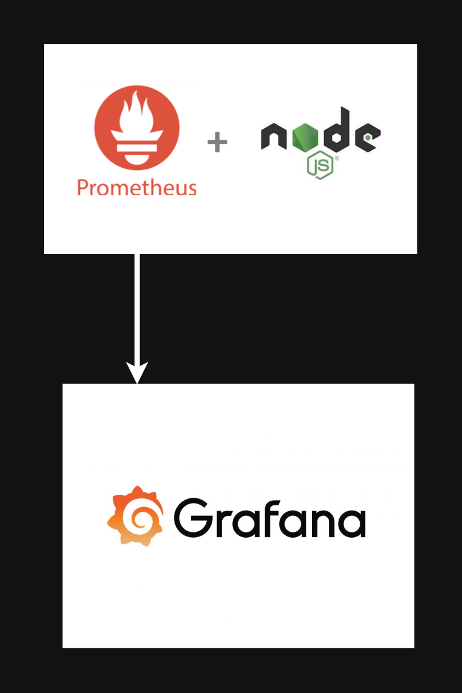

# Grafana and Prometheus Integration

This repository demonstrates how to set up a Node.js application that exposes metrics to Prometheus and visualizes those metrics using Grafana.

## Repository

The code repository can be found at:

```
https://github.com/KaramHussain/grafana-promethius
```

## Files

This repository contains the following files:

- **`index.js`**: Main Node.js application code
- **`prometheus.yml`**: Prometheus configuration file
- **`package.json`**: Node.js dependencies file

## Setup Instructions

### Clone the Repository

To clone the repository, use the following command:

```
git clone https://github.com/KaramHussain/grafana-promethius.git
```

### Install Node.js

Update your package list and install Node.js:

```
sudo apt update
sudo apt install nodejs
```

### Install Application Dependencies

Navigate into the repository directory and install dependencies:

```
cd grafana-promethius
npm install
npm install -g pm2
```

### Start the Node.js Application

Start the Node.js application using PM2:

```
pm2 start index.js --name nodejs-app
```

The application will be running on port 8080 and exposing metrics at `http://0.0.0.0:8080/metrics`.

### Install Prometheus

Use the following commands to install Prometheus and configure it:

```
# Create Prometheus configuration directory
mkdir -p /home/ubuntu/nodejs-app

# Place prometheus.yml in the directory
# The content of prometheus.yml is below

# Run Prometheus container
docker run -d \
  -p 9090:9090 \
  -v /home/ubuntu/nodejs-app/prometheus.yml:/etc/prometheus/prometheus.yml \
  --name prometheus \
  prom/prometheus
```

### Prometheus Configuration

The content of **`prometheus.yml`**:

```
global:
  scrape_interval: 5s
scrape_configs:
  - job_name: "nodeapp"
    static_configs:
      - targets: ["http://3.88.8.34:8080"]
```

### Install Grafana

Use the following commands to install Grafana:

```
sudo apt install gnupg2 apt-transport-https software-properties-common wget

wget -q -O - https://packages.grafana.com/gpg.key > grafana.key
cat grafana.key | gpg --dearmor | sudo tee /etc/apt/trusted.gpg.d/grafana.gpg > /dev/null

echo 'deb [signed-by=/etc/apt/trusted.gpg.d/grafana.gpg] https://packages.grafana.com/oss/deb stable main' | sudo tee /etc/apt/sources.list.d/grafana.list

sudo apt update
sudo apt install grafana
sudo systemctl daemon-reload
sudo systemctl start grafana-server
sudo systemctl status grafana-server
```

### Configure Grafana

1. Log in to Grafana using the default credentials **`admin`/`admin`**.
2. Change the default password.
3. Add Prometheus as a data source:
   - Go to **Configuration** > **Data Sources**.
   - Add a new data source of type **Prometheus**.
   - Set the URL to `http://<EC2-PUBLIC-IP>:9090`.
4. Import a dashboard:
   - Go to **Create** > **Import**.
   - Use the dashboard ID `11159` for the Node Exporter Full dashboard.
   - Follow the prompts to complete the import.

### Node.js Application Code

**`index.js`**:

```
const http = require('http')
const url = require('url');
const client = require('prom-client')

const register = new client.Registry()

register.setDefaultLabels({
  app: 'nodejs-app'
})

client.collectDefaultMetrics({ register })

const httpRequestDurationMicroseconds = new client.Histogram({
  name: 'http_request_duration_seconds',
  help: 'Duration of HTTP requests in seconds',
  labelNames: ['method', 'route', 'code'],
  buckets: [0.1, 0.3, 0.5, 0.7, 1, 3, 5, 7, 10] // 0.1 to 10 seconds
})

register.registerMetric(httpRequestDurationMicroseconds)

const createOrderHandler = async (req, res) => {
  // return an error 1% of the time
  if ((Math.floor(Math.random() * 100)) === 0) {
    throw new Error('Internal Error')
  }

  // delay for 3-6 seconds
  const delaySeconds = Math.floor(Math.random() * (6 - 3)) + 3
  await new Promise(res => setTimeout(res, delaySeconds * 1000))

  res.end('Order created successfully');
}

const server = http.createServer(async (req, res) => {
  const end = httpRequestDurationMicroseconds.startTimer();
  const route = url.parse(req.url).pathname;

  try {
      if (route === '/metrics') {
        res.setHeader('Content-Type', register.contentType)
        res.end(register.metrics())
      }

      if (route === '/order') {
        await createOrderHandler(req, res)
      }

  } catch (error) {
    res.writeHead(500).end()
  }

  if (!res.finished) {
    res.writeHead(404).end() // Default 404 handler
  }

  end({ route, code: res.statusCode, method: req.method })
})

server.listen(8080, '0.0.0.0', () => {
  console.log('Server is running on http://0.0.0.0:8080, metrics are exposed on http://0.0.0.0:8080/metrics')
})
```

#### Explanation of Prometheus Client Integration

The **`prom-client`** library is used to create and manage metrics for Prometheus. Here’s how it is used in the code:

1. **Library Initialization**:

   ```
   const client = require('prom-client')
   const register = new client.Registry()
   ```

   - `prom-client` is imported and an instance of `Registry` is created. This registry will hold and manage the metrics.

2. **Default Labels and Metrics**:

   ```
   register.setDefaultLabels({
     app: 'nodejs-app'
   })

   client.collectDefaultMetrics({ register })
   ```

   - **`register.setDefaultLabels`**: Sets default labels for all metrics. In this case, every metric will have the label `app` with the value `nodejs-app`.
   - **`client.collectDefaultMetrics`**: Collects default metrics related to the Node.js process, such as memory usage and event loop latency.

3. **Custom Metric - Histogram**:

   ```
   const httpRequestDurationMicroseconds = new client.Histogram({
     name: 'http_request_duration_seconds',
     help: 'Duration of HTTP requests in seconds',
     labelNames: ['method', 'route', 'code'],
     buckets: [0.1, 0.3, 0.5, 0.7, 1, 3, 5, 7, 10] // 0.1 to 10 seconds
   })

   register.registerMetric(httpRequestDurationMicroseconds)
   ```

   - **`client.Histogram`**: Defines a histogram metric to measure the duration of HTTP requests.
     - **`name`**: The name of the metric.
     - **`help`**: A description of the metric.
     - **`labelNames`**: Labels for the metric (e.g., `method`, `route`, `code`).
     - **`buckets`**: Defines the buckets for histogram data. These are the ranges in which request durations will be counted.

4. **Metrics Endpoint**:

   ```
   if (route === '/metrics') {
     res.setHeader('Content-Type', register.contentType)
     res.end(register.metrics())
   }
   ```

   - When the `/metrics` endpoint is accessed, the server responds with the collected metrics in Prometheus format.

5. **Timing HTTP Requests**:

   ```
   const end = httpRequestDurationMicroseconds.startTimer();
   ```

   - **`startTimer`**: Starts timing the duration of HTTP requests and will record the duration when the request finishes.

6. **Handling Requests**:

   ```
   end({ route, code: res.statusCode, method: req.method })
   ```

   - Records the duration of the HTTP request along with labels for the route, HTTP status code, and HTTP method.

### Modifying Existing Projects

To integrate Prometheus metrics into an existing Node.js project:

1. **Install `prom-client`**:

   ```
   npm install prom-client
   ```

2. **Create and Register Metrics**:

   Add code similar to the histogram example to define and register your metrics.

3. **Expose Metrics Endpoint**:

   Implement an endpoint (e.g., `/metrics`) to serve the metrics data.

4. **Configure Prometheus**:

   Update your `prometheus.yml` file to include the endpoint of your application.
